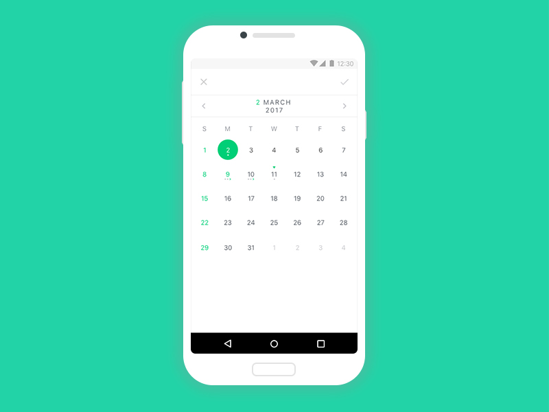
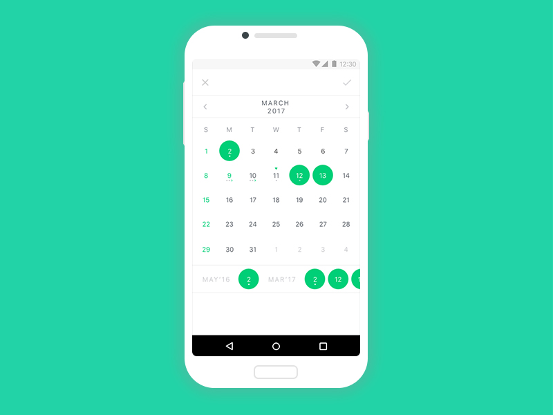
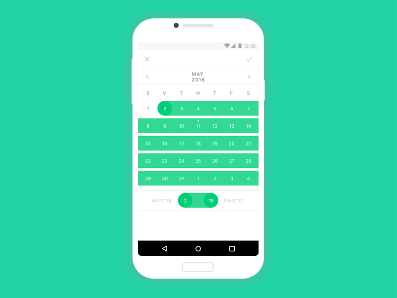
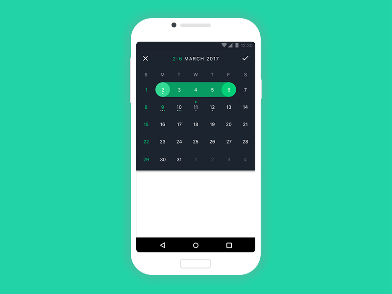

# CosmoCalendar
[](https://github.com/AppliKeySolutions/CosmoCalendar/blob/master/LICENSE)

Made by [Applikey Solutions](https://applikeysolutions.com)


* [Usage](#usage)
* [Customization](#customization)
   * [Common](#common)
   * [Selection](#selection)
   * [Current day](#current-day)
   * [Navigation buttons](#navigation-buttons)
   * [Weekend days](#weekend-days)
   * [Connected days](#connected-days)
   * [Disabled days](#disabled-days)
   * [Calendar dialog](#calendar-dialog)
* [Demo](#demo)
* [License](#license)

# Usage
  ```xml
  compile 'com.github.applikeysolutions:cosmocalendar:1.0.1'
  ```

# Customization

  ### Common
  * calendarOrientation - Possible values: HORIZONTAL, VERTICAL
  * calendarBackgroundColor
  * monthTextColor
  * otherDayTextColor
  * dayTextColor
  * firstDayOfTheWeek
  * weekDayTitleTextColo
  * showDaysOfWeek - Defines if we need to display week day titles for every month
  * showDaysOfWeekTitle - Defines if we need to display week day title for whole calendar
  
  ### Selection
  * selectionType - Possible values: SINGLE, MULTIPLE, RANGE
  * selectedDayTextColor
  * selectedDayBackgroundColor
  * selectedDayBackgroundStartColor - Background color of START day from selected range
  * selectedDayBackgroundEndColor - Background color of END day from selected range
  * selectionBarMonthTextColor
  
  ### Current day
  * currentDayTextColor
  * currentDayIconRes
  * currentDaySelectedIconRes
  
  ### Navigation buttons
  * previousMonthIconRes
  * nextMonthIconRes
  
  ### Weekend days
  * weekendDays
  ```java
  calendarView.setWeekendDays(new HashSet(){{
            add(Calendar.THURSDAY);
            add(Calendar.TUESDAY);
  }});
  ```
  
  * weekendDayTextColor
  
  ### Connected days
  You can add some days for example holidays:
  ```java
  Set<Long> connectedDaysSet = new HashSet<>();
  connectedDaysSet.add(System.currentTimeMillis());
  calendarView.setConnectedCalendarDays(connectedDaysSet);
  ```
  and customize them:
  * connectedDayTextColor
  * connectedDaySelectedTextColor
  * connectedDayIconRes;
  * connectedDaySelectedIconRes;
  * connectedDayIconPosition (TOP/BOTTOM);
  ```java
  calendarView.setConnectedDayIconPosition(ConnectedDayIconPosition.TOP);
  ```
  
  ### Disabled days
  You can add days so that you can not select them:
  ```java
  Set<Long> disabledDaysSet = new HashSet<>();
  disabledDaysSet.add(System.currentTimeMillis());
  calendarView.setDisabledDays(disabledDaysSet);
  ```
  #### Disabled days criteria
  - month criteria range:
  ```java
  calendarView.setDisabledDaysCriteria(new DisabledDaysCriteria(1, 5, DisabledDaysCriteriaType.DAYS_OF_MONTH)); //from 1st to 5th day of the month
  ```
  - week criteria range:
  ```java
  calendarView.setDisabledDaysCriteria(new DisabledDaysCriteria(1, 5, DisabledDaysCriteriaType.DAYS_OF_MONTH)); //from 1st to 5th day of the month
  ```
  
  * disabledDayTextColor - Text color of disabled day

  ### Calendar dialog
   ```java
   new CalendarDialog(this, new OnDaysSelectionListener() {
            @Override
            public void onDaysSelected(List<Day> selectedDays) {
                
            }
        }).show();
   ```
# Demo
Single Choice             |  Multiple
:-------------------------:|:-------------------------:
  |  
Range             |  Customized
  |  

# License

    MIT License

    Copyright (c) 2017 Applikey Solutions

    Permission is hereby granted, free of charge, to any person obtaining a copy
    of this software and associated documentation files (the "Software"), to deal
    in the Software without restriction, including without limitation the rights
    to use, copy, modify, merge, publish, distribute, sublicense, and/or sell
    copies of the Software, and to permit persons to whom the Software is
    furnished to do so, subject to the following conditions:

    The above copyright notice and this permission notice shall be included in all
    copies or substantial portions of the Software.

    THE SOFTWARE IS PROVIDED "AS IS", WITHOUT WARRANTY OF ANY KIND, EXPRESS OR
    IMPLIED, INCLUDING BUT NOT LIMITED TO THE WARRANTIES OF MERCHANTABILITY,
    FITNESS FOR A PARTICULAR PURPOSE AND NONINFRINGEMENT. IN NO EVENT SHALL THE
    AUTHORS OR COPYRIGHT HOLDERS BE LIABLE FOR ANY CLAIM, DAMAGES OR OTHER
    LIABILITY, WHETHER IN AN ACTION OF CONTRACT, TORT OR OTHERWISE, ARISING FROM,
    OUT OF OR IN CONNECTION WITH THE SOFTWARE OR THE USE OR OTHER DEALINGS IN THE
    SOFTWARE.
